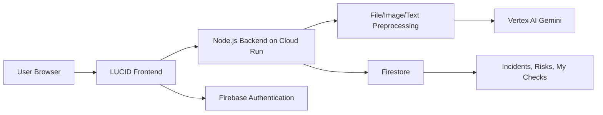

<div align="center">
  

# LUCID

### Clarity Through the Chaos.

**An AI-powered cybersecurity assistant that helps everyday users understand suspicious evidence while giving analysts structured technical intelligence.**

**Production App:** https://lucid-dmhlvl2qqa-uc.a.run.app
**Release:** Version 1.0 production build
**Cloud Run Revision:** `lucid-00013-xwc`

</div>

---

## What is LUCID?

LUCID is an AI-powered security analysis application built to make confusing cybersecurity evidence easier to understand and act on. Users can submit suspicious messages, alerts, screenshots, logs, files, source code, or Wireshark-style network screenshots and receive a clear security assessment.

LUCID supports two audiences from the same evidence. **ShieldMe** explains risk in plain language for everyday users, while **TIQ** provides analyst-focused classification, severity, MITRE ATT&CK context, indicators, reasoning, and recommended response actions.

The goal is not to replace human judgment. LUCID helps reduce confusion, speed up triage, preserve evidence, and provide a safer first interpretation of suspicious security material.

---

## Key Features

| Feature | Purpose |
|---|---|
| **ShieldMe** | Plain-language security guidance for everyday users. |
| **TIQ** | Technical analyst mode with classification, severity, MITRE ATT&CK mapping, indicators, and SOC actions. |
| **Multimodal Analysis** | Analyze text, screenshots, alerts, documents, logs, code, and network evidence. |
| **File Analysis** | Safely extracts readable content from supported files without executing uploaded content. |
| **Wireshark Screenshot Analysis** | Interprets network-capture screenshots such as scanning or beaconing patterns. |
| **Incident Correlation** | Links the same evidence across ShieldMe and TIQ into one active incident when appropriate. |
| **TIQ Dashboard** | Tracks incidents, severity, status, source, evidence, and analyst workflow. |
| **Risk Register** | Helps analysts track and manage security risks. |
| **My Checks** | Lets ShieldMe users view their recent personal analysis history. |
| **Expanded Help** | In-app guidance covering modes, uploads, incident handling, limitations, and best practices. |

---

## Supported Evidence

LUCID can analyze several forms of supplied evidence:

- Suspicious messages and emails
- URLs and login/payment requests
- Security alerts and SIEM-style alert text
- Screenshots and images
- Wireshark/network screenshots
- PDF, DOCX, CSV, TXT, Markdown, log files, and source code

Uploaded files are treated as data. LUCID extracts readable content where possible, applies validation and static checks, and sends safe analysis context to the AI pipeline. Uploaded content is **not executed**.

---

## Architecture Overview



At a high level, LUCID receives evidence from the browser, validates and preprocesses it on the backend, sends security-focused context to Gemini through Vertex AI, stores user-scoped analysis records in Firestore, and presents either ShieldMe or TIQ results depending on the selected mode.

---

## Technology Stack

| Layer | Technology |
|---|---|
| Frontend | HTML, CSS, JavaScript single-page app |
| Backend | Node.js / Express |
| AI | Vertex AI Gemini |
| Authentication | Firebase Authentication with Google Sign-In |
| Database | Firestore |
| Deployment | Google Cloud Run |
| Build/Artifacts | Cloud Build and Artifact Registry |
| File Processing | Multer, Sharp, pdf-parse, Mammoth, csv-parse |

---

## Validation Summary

| Evaluation Area | Final Result |
|---|---:|
| Primary benchmark: Core + Generalization + Adversarial | **68/74 strict PASS = 91.9%** |
| ShieldMe primary benchmark | **74/74 successful outcomes** |
| File pipeline smoke validation | **19/19 PASS** |
| Extended file validation | **17/17 PASS** |
| Wireshark screenshot validation | **16/16 PASS** |

The primary benchmark, file-pipeline validation, and Wireshark validation are reported separately to avoid overstating accuracy. Detailed methodology and case-level evidence are available in the Accuracy Report and Test Cases documents.

---

## Documentation

| Document | Purpose |
|---|---|
| [`docs/PROJECT_OVERVIEW.md`](docs/PROJECT_OVERVIEW.md) | Judge-friendly project story: problem, solution, uniqueness, use cases, impact, and future scope. |
| [`docs/USER_GUIDE.md`](docs/USER_GUIDE.md) | Practical guide for using ShieldMe, TIQ, uploads, Dashboard, My Checks, Risk Register, and Help. |
| [`docs/LUCID_Project_Technical_Handbook.pdf`](docs/LUCID_Project_Technical_Handbook.pdf) | Full technical handbook covering architecture, implementation, validation, security, deployment, and roadmap. |
| [`docs/LUCID_ACCURACY_TEST_REPORT.md`](docs/LUCID_ACCURACY_TEST_REPORT.md) | Evaluation methodology, results, accuracy evolution, limitations, and interpretation. |
| [`docs/LUCID_ACCURACY_TEST_CASES.md`](docs/LUCID_ACCURACY_TEST_CASES.md) | Complete case-level testing record for the benchmark and validation suites. |
| [`RUNBOOK.md`](RUNBOOK.md) | Developer and operator instructions for setup, testing, deployment, and troubleshooting. |

---

## Quick Start

```bash
npm install
npm start
```

Then open the local application in a browser, sign in with Google, choose ShieldMe or TIQ, and submit evidence for analysis.

For production, use the deployed Cloud Run application:

```text
https://lucid-dmhlvl2qqa-uc.a.run.app
```

Operational setup and deployment details are documented in [`RUNBOOK.md`](RUNBOOK.md).

---

## Future Roadmap

LUCID is designed as a modular foundation for AI-assisted cybersecurity analysis. Planned enhancements include:

- Real-time threat intelligence enrichment for URLs, domains, IPs, and IOCs.
- Expanded file support for email files, ZIP archives, Office macros, and additional forensic artifacts.
- Enterprise SIEM/SOAR integrations such as Google SecOps, Splunk, Microsoft Sentinel, and QRadar.
- Enhanced AI reasoning with better explainability, confidence calibration, and multimodal interpretation.
- Cross-platform support through browser, email, mobile, and collaboration-tool integrations.
- Continuous benchmarking using larger real-world datasets to improve robustness and generalization.

---

## Responsible Use

LUCID provides AI-assisted security interpretation based on the evidence supplied by the user. It does not guarantee that a message, file, system, or network is safe. Important security decisions should be verified using appropriate human review, logs, endpoint data, and organizational security procedures.

---

## Documentation Analysis — Final Validation

LUCID now detects software and project documentation as benign content using
content-only signals (Markdown headings, section keywords, and structural
markers). No filename is used in detection.

Markdown, HTML snippets, architecture text, deployment instructions, and
security terminology found inside documentation files are not treated as
malicious unless direct malicious behaviour is present in the content itself.
Raw phishing and malware evidence detection is fully preserved.

**Documentation/threat regression test: 19/19 PASS, 0 FAIL.**

Final analyzer SHA-256:
`e2fc73549a541828c7356d45e626e1e09cd3e52f83349c96f575df0be1e93c8d`

---

## License

This repository is prepared as a Version 1.0 production build. Add a license before broad public reuse if the repository is made public.
