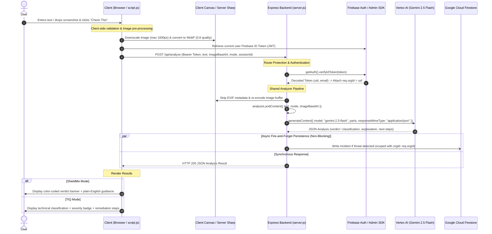

# LUCID — System Architecture & Operations Runbook

## 1. Executive Summary & Platform Overview

**LUCID** is an AI-powered security threat analysis and threat intelligence platform designed to inspect suspicious communications (phishing emails, smishing SMS, fake login portals, malicious QR codes, and rogue system warnings).

The platform features a **Dual-Persona Experience**:
- **ShieldMe (Everyday Mode):** Plain-English safety verdicts (`Safe`, `Suspicious`, `Dangerous`), actionable next steps, and a private, session-scoped history log (*My Checks*).
- **TIQ (Analyst Mode):** Technical taxonomy, severity scoring (`Low`, `Medium`, `High`, `Critical`), MITRE-aligned reasoning, recommended remediation actions, and a full **SecOps Dashboard** (incidents, trends, pattern detection, and risk register).

---

## 2. End-to-End User Input Lifecycle



### Detailed Step-by-Step Flow

#### Step 1: Input Submission & Client-Side Pre-processing
1. **User Action:** The user pastes text into `#suspicious-text` and/or drops a screenshot into `#upload-area`.
2. **Client Validation:** Verifies that text or an image is present; enforces 8MB file upload cap and validates MIME types (`image/png`, `image/jpeg`, `image/webp`).
3. **Client Image Downscaling:** Downscales images exceeding 1600px edge dimensions while maintaining aspect ratio, converting to WebP (`quality: 0.8`) Base64.

#### Step 2: Authentication & Token Injection
1. Client invokes `fetchWithAuth('/api/analyze', ...)`:
   - Retrieves fresh Firebase ID Token via `auth.currentUser.getIdToken()`.
   - Injects header `Authorization: Bearer <idToken>`.

#### Step 3: Backend Authentication Middleware
1. **Header Validation:** Express intercepts the request via `authMiddleware`.
2. **Token Verification:** Calls `getAuth().verifyIdToken(token)` against Google public certificates.
3. **Multi-Tenant Scoping:** Assigns `req.orgId = decodedToken.uid`.

#### Step 4: Server-Side Processing & Shared Analyzer Execution
1. **EXIF Stripping:** Server receives Base64 image and passes buffer to `sharp` to strip all EXIF/GPS/device metadata.
2. **Shared Analyzer Pipeline:** Delegates analysis to `analyzeLucidContent({ text, mode, imageBase64 })` in `lib/analyzeLucidContent.js`.
3. **Prompt Injection Defense:** User payload is encapsulated within `<user_submitted_content>` tags with strict system instructions preventing jailbreaks.

#### Step 5: Gemini 2.5 Flash Inference & Deterministic Correction
1. Request dispatched to Vertex AI (`gemini-2.5-flash` in `us-central1`).
2. Gemini evaluates linguistic, contextual, and visual signals.
3. Output is validated against JSON schema and passed through `applyEvidenceConsistency` for deterministic taxonomy/precedence rules.

#### Step 6: Isolated Firestore Incident Persistence (Non-Blocking)
1. If a threat is detected (`Suspicious`/`Dangerous` in ShieldMe, or `Medium`/`High`/`Critical` in TIQ), an incident record is logged to Firestore asynchronously.

#### Step 7: Client Result Presentation
1. Renders results dynamically with XSS protection via `escapeHtml()`.

---

## 3. Architecture & Multi-Tenancy Design

```
+-------------------------------------------------------------------------+
|                               Client UI                                 |
| (Vanilla HTML5, ES6+, CSS Glassmorphism, Firebase Auth Client SDK)      |
+------------------------------------+------------------------------------+
                                     |
                         HTTPS Bearer JWT Token
                                     |
+------------------------------------v------------------------------------+
|                         Node.js / Express Server                        |
|                                                                         |
|  +---------------------+  +--------------------+  +------------------+  |
|  |   Rate Limiter      |  |  authMiddleware    |  |  sharp Pipeline  |  |
|  |  (100 req/15 min)   |  | (Firebase Admin)   |  | (EXIF Stripping) |  |
|  +---------------------+  +--------------------+  +------------------+  |
+-------------------+------------------------------------+----------------+
                    |                                    |
          Shared Analyzer Module               Scoped DB Queries
                    |                                    |
+-------------------v---------------+  +-----------------v----------------+
|      Google Vertex AI             |  |     Google Cloud Firestore       |
|  (gemini-2.5-flash @ us-central1) |  |      (Multi-Tenant Collections)  |
+-----------------------------------+  +----------------------------------+
```

### Multi-Tenancy Data Scoping
- **Single-User-per-Org Pattern:** Each authenticated user UID functions as an isolated `orgId`.
- **Database Partitioning:** All `incidents` and `risks` documents store an `orgId` field.
- **Strict Endpoint Scoping:** All queries filter by `.where('orgId', '==', req.orgId)`. `PATCH` and `DELETE` handlers verify `doc.data().orgId === req.orgId`.
- **Firestore Security Rules:** `firestore.rules` enforces `request.auth.uid == resource.data.orgId` directly.

---

## 4. Environment Variables & Production Config

| Variable | Purpose | Default / Production Value |
|---|---|---|
| `PORT` | HTTP server port | `3000` (Cloud Run sets `8080`) |
| `FRONTEND_ORIGIN` | CORS allowed origin | `http://localhost:3000` (Set to prod domain) |
| `GOOGLE_CLOUD_PROJECT` | GCP Project ID | `project-c48afffb-501b-4711-a6d` |
| `GCLOUD_PROJECT` | Fallback GCP Project ID | `project-c48afffb-501b-4711-a6d` |

---

## 5. Operations & Health Checks

### Starting / Restarting the Application
```bash
# Start dev server
npm start
```

### Static Validation Checks
```bash
# Validate JS syntax
node --check lib/analyzeLucidContent.js
node --check server.js
node --check public/script.js

# Check for trailing whitespace & formatting
git diff --check

# Verify zero benchmark IDs in production
grep -rn "TC-\|GEN-\|ADV-" lib/ server.js
```

### Benchmark Evaluation Commands
*(Note: Benchmark scripts execute against Vertex AI and require GCP credentials)*
```bash
# Core 26-case suite
node scratch/run_accuracy_suite.js && node scratch/evaluate_results.js

# Generalization 18-case unseen suite
node scratch/run_generalization_suite.js && node scratch/evaluate_generalization.js

# Adversarial 30-case unseen suite
node scratch/run_adversarial_suite.js && node scratch/evaluate_adversarial.js
```

---

## 6. Current Benchmark Status

- **Core Suite (26 cases):** 23 PASS (88.5%), 3 PARTIAL (11.5%), 0 FAIL. ShieldMe 26/26 (100%).
- **Generalization Suite (18 cases):** 18 PASS (100%), 0 PARTIAL, 0 FAIL. ShieldMe 18/18 (100%), 0 FP, 0 FN.
- **Adversarial Suite (30 cases):** 27 PASS (90.0%), 3 PARTIAL (10.0%), 0 FAIL. ShieldMe 30/30 (100%), 0 FP, 0 FN.
- **Combined Benchmark (74 cases):** **68 PASS (91.9%)**, 6 PARTIAL (8.1%), 0 FAIL. ShieldMe **74/74 (100%)**.

---

## 7. Known Technical Debt

- **SDK Migration:** `@google-cloud/vertexai` SDK outputs a deprecation notice scheduled for removal June 24, 2026. Future refactoring will migrate to `@google/genai`.

---

## 8. Version History & Changelog

- **v1.0.0 — Initial Release:** Single-page AI threat analyzer for text and images with Vertex AI.
- **v1.1.0 — SecOps Dashboard:** Added incidents table, 7-day volume trends, 30-day pattern aggregator, and CSV export.
- **v1.2.0 — Dual-Persona Separation:** Added ShieldMe mode with *My Checks* session history and restricted technical dashboard to TIQ mode.
- **v1.3.0 — UI Polishing:** Added compact three-dot dropdown menu, edit modal, and status workflows (`Open`, `In Progress`, `Resolved`).
- **v1.4.0 — Multi-Tenant Architecture:** Integrated Firebase Authentication (Google Sign-In), route protection middleware (`authMiddleware`), multi-tenant data scoping (`orgId`), and updated composite indexes.
- **v1.5.0 — Dashboard Filters & Incident Aging:** Added TIQ Dashboard quick-filters and "Days Open" aging indicator.
- **v1.6.0 — Formal Accuracy Test Suite:** Executed initial 26-case accuracy benchmark.
- **v1.7.0 — Multi-Suite Accuracy & Generalization Optimization:** Expanded benchmark coverage across Core, Generalization, and Adversarial suites.
- **v2.0.0 — Shared Production Architecture & Final 91.9% Benchmark:** Refactored benchmark runners to execute through the shared production analyzer module (`lib/analyzeLucidContent.js`). Achieved **91.9% combined strict PASS rate** (68/74 cases), **100% ShieldMe PASS** (74/74 cases), **0 False Positives**, **0 False Negatives**, and 0 FAIL results across all 74 benchmark test cases.
