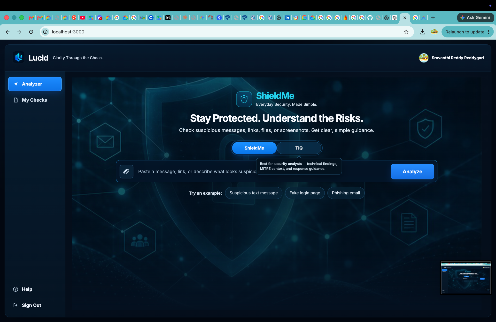
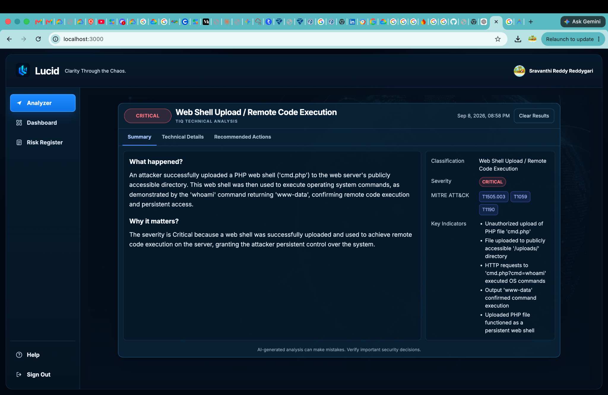
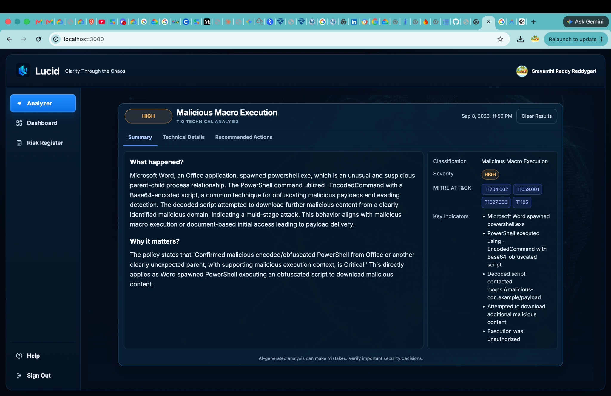
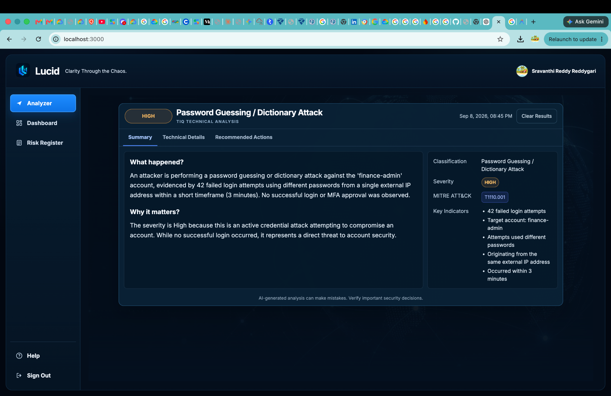
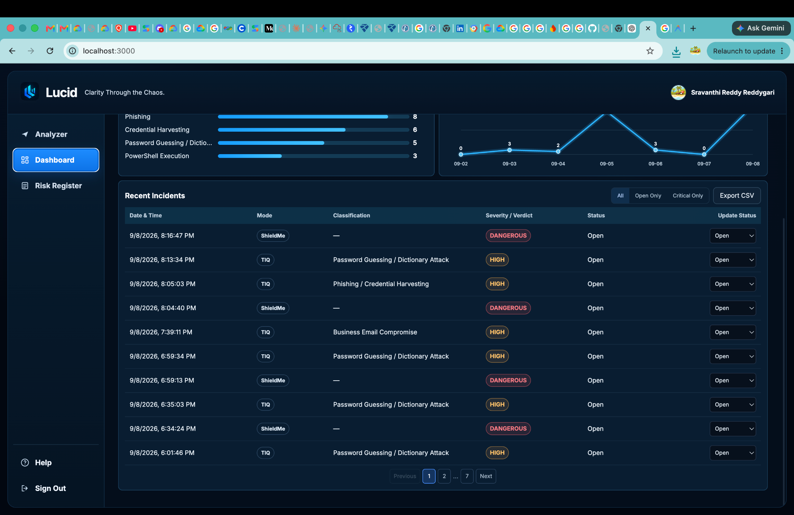
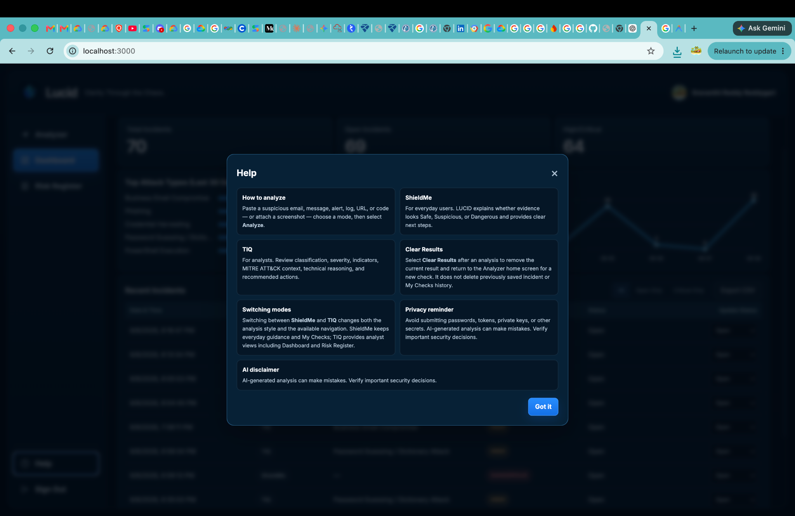
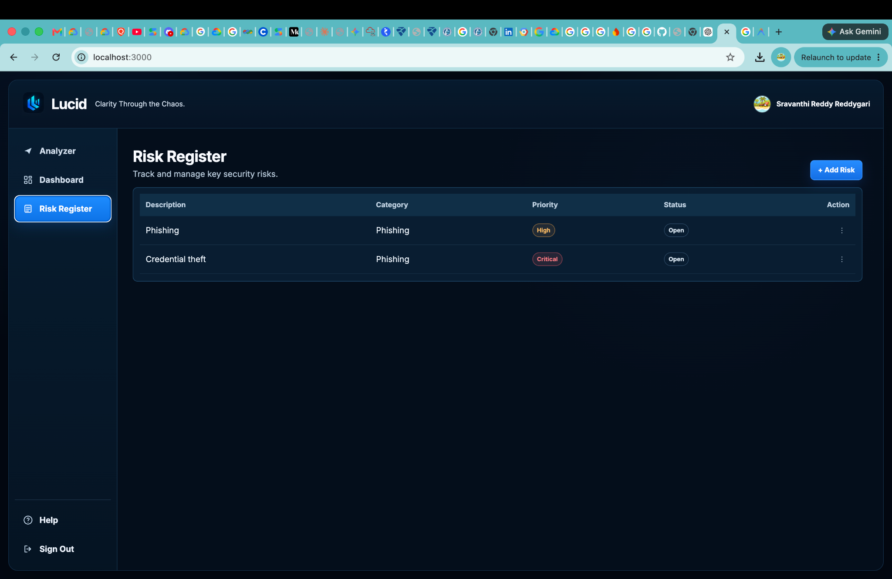

<div align="center">
  

# LUCID

*Clarity Through the Chaos.*

# USER GUIDE

**Version 1.0**

**September 2026**

**LUCID Documentation Suite**
</div>

---

## Document Information

**Purpose**
This User Guide explains how to use LUCID in its final production workflow. It is written for everyday users, security analysts, evaluators, and anyone who wants to understand how LUCID turns confusing cybersecurity evidence into clear, actionable analysis.

**Intended Audience**

- Everyday users who want help understanding suspicious messages, alerts, screenshots, or files.
- Security analysts who need structured triage, classification, severity, indicators, MITRE ATT&CK context, and incident workflow support.
- Evaluators reviewing the usability, safety, and reliability of the LUCID application.

**Related Documents**

- `README.md` — short GitHub project introduction.
- `docs/PROJECT_OVERVIEW.md` — project story, problem, solution, value, and roadmap.
- `docs/LUCID_Project_Technical_Handbook.pdf` — technical architecture and implementation.
- `docs/LUCID_ACCURACY_TEST_REPORT.md` — validation methodology and results.
- `docs/LUCID_ACCURACY_TEST_CASES.md` — detailed benchmark and test-case evidence.
- `RUNBOOK.md` — operations, deployment, and maintenance.

---

## Table of Contents

1. [What LUCID Does](#1-what-lucid-does)
2. [Who LUCID Is For](#2-who-lucid-is-for)
3. [Getting Started](#3-getting-started)
4. [Understanding the Two Modes](#4-understanding-the-two-modes)
5. [Using ShieldMe](#5-using-shieldme)
6. [Using TIQ](#6-using-tiq)
7. [Text, Screenshot, and Image Analysis](#7-text-screenshot-and-image-analysis)
8. [File and Document Analysis](#8-file-and-document-analysis)
9. [Wireshark and Network Evidence](#9-wireshark-and-network-evidence)
10. [My Checks](#10-my-checks)
11. [TIQ Dashboard](#11-tiq-dashboard)
12. [Incident Correlation](#12-incident-correlation)
13. [Incident Details, Notes, and Resolution](#13-incident-details-notes-and-resolution)
14. [Risk Register](#14-risk-register)
15. [Pattern Detection](#15-pattern-detection)
16. [Help and Guidance](#16-help-and-guidance)
17. [Privacy and Security](#17-privacy-and-security)
18. [Understanding Verdicts and Limitations](#18-understanding-verdicts-and-limitations)
19. [Best Practices](#19-best-practices)
20. [Troubleshooting](#20-troubleshooting)
21. [Short Future Roadmap](#21-short-future-roadmap)

---

## 1. What LUCID Does

LUCID is an AI-powered cybersecurity assistant that helps users understand suspicious security evidence. It can analyze text, screenshots, security alerts, documents, logs, source code snippets, and Wireshark-style network screenshots. The goal is to reduce confusion and help users decide what to do next.

LUCID is designed around a simple idea: the same security evidence may need to be explained differently depending on who is reading the result. An everyday user may need a clear warning and simple next steps. A security analyst may need classification, severity, indicators, MITRE ATT&CK context, and incident tracking.

LUCID supports both needs through two modes: **ShieldMe** for plain-language user guidance and **TIQ** for analyst-grade investigation.

> **Key takeaway:** LUCID does not replace human judgment. It helps users and analysts interpret supplied evidence faster, more consistently, and with clearer next steps.

---

## 2. Who LUCID Is For

LUCID supports two primary audiences.

| Audience | What they need | LUCID mode |
|---|---|---|
| Everyday users | Simple explanation, risk level, next steps | ShieldMe |
| Security analysts | Technical classification, severity, indicators, MITRE mapping, workflow support | TIQ |

Everyday users can use LUCID when they receive a suspicious email, message, login alert, payment request, file, or screenshot and are unsure whether it is safe.

Security analysts can use LUCID to triage evidence, organize incidents, track risks, and reduce repeated investigations of the same event.

---

## 3. Getting Started

Open the production application:

```text
https://lucid-dmhlvl2qqa-uc.a.run.app
```

Sign in using the configured Google Sign-In flow. Authentication is required so that LUCID can separate each user or tenant's data and prevent one user from accessing another user's incidents or checks.

After signing in, choose the mode that matches your task:

- Use **ShieldMe** when you want a simple explanation and practical safety steps.
- Use **TIQ** when you want technical analysis and incident-management workflow.

### Basic Workflow

1. Choose ShieldMe or TIQ.
2. Paste text or upload supported evidence.
3. Submit the analysis.
4. Review the verdict, explanation, and recommended next steps.
5. In TIQ, review incidents, risks, and patterns in the Dashboard.

---

## 4. Understanding the Two Modes

### ShieldMe

ShieldMe is built for clarity. It avoids unnecessary jargon and explains whether something appears safe, suspicious, dangerous, or inconclusive. It focuses on what the user should do next.

### TIQ

TIQ is built for structured investigation. It provides classification, severity, MITRE ATT&CK mappings, key indicators, technical reasoning, confidence, unknowns, and SOC-style response actions.

| Capability | ShieldMe | TIQ |
|---|---:|---:|
| Plain-language explanation | Yes | Limited |
| Technical classification | No | Yes |
| Severity level | Simplified | Detailed |
| MITRE ATT&CK mapping | No | Yes |
| Analyst reasoning | No | Yes |
| Dashboard incidents | No | Yes |
| Risk Register | No | Yes |
| My Checks | Yes | No |

---

## 5. Using ShieldMe

ShieldMe helps users understand suspicious evidence without needing cybersecurity training.

### What it is

ShieldMe is the everyday-user mode in LUCID. It produces a clear verdict, a short explanation, and practical next steps.

### Why it exists

Many security warnings are written for technical teams, not ordinary users. A user may receive a suspicious payment request, login alert, or attachment and not know whether to ignore it, report it, or take urgent action. ShieldMe reduces that uncertainty.

### How to use it

1. Select **ShieldMe** from the left navigation.
2. Paste suspicious text, upload a screenshot, or upload a supported file.
3. Select **Analyze**.
4. Review the verdict and next steps.
5. Check **My Checks** later if you want to revisit the result.



**Figure 1.** ShieldMe provides a simplified interface for everyday users to submit suspicious messages, screenshots, alerts, or files.

### ShieldMe output

ShieldMe focuses on:

- clear verdict
- simple explanation
- practical action steps
- avoidance of unnecessary technical language

Typical next steps may include not clicking a suspicious link, verifying a request using a trusted channel, changing a password, enabling MFA, or reporting the message to a security team.

> **Key takeaway:** ShieldMe is designed to help users make safer decisions quickly without needing to interpret raw security indicators.

---

## 6. Using TIQ

TIQ, or Threat Intelligence Query, is the analyst-focused mode of LUCID.

### What it is

TIQ produces structured technical analysis for security triage and investigation. It is designed for users who need deeper reasoning than ShieldMe provides.

### Why it exists

Analysts often need more than a general warning. They need to know what kind of threat is present, how severe it is, what indicators support the conclusion, which MITRE ATT&CK techniques apply, and what actions should be taken next.

### How to use it

1. Select **TIQ** from the left navigation.
2. Paste security evidence or upload a supported screenshot/file.
3. Run the analysis.
4. Review the technical classification, severity, indicators, reasoning, MITRE mapping, and recommended analyst actions.
5. Open the Dashboard to review related incidents, risks, and patterns.



**Figure 2.** TIQ presents structured security analysis including classification, severity, reasoning, indicators, and analyst guidance.

### TIQ output fields

TIQ may display:

- Verdict
- Classification
- Severity
- MITRE ATT&CK techniques
- Key indicators
- Technical reasoning
- Attack chain
- Severity rationale
- Recommended action
- SOC actions
- Confidence
- Unknowns

> **Key takeaway:** TIQ is designed for technical triage and supports a deeper investigation workflow than ShieldMe.

---

## 7. Text, Screenshot, and Image Analysis

LUCID supports multiple evidence types so users are not limited to typing a description manually.

### Text evidence

Text evidence can include suspicious emails, SMS messages, chat messages, login alerts, security logs, payment requests, or incident descriptions.

### Screenshot evidence

Screenshot analysis is useful when evidence exists inside another application, browser page, email client, security console, or Wireshark view. Users can upload the screenshot and let LUCID reason over the visible evidence.

### Image processing

Images are handled as evidence. LUCID may preprocess image data for safe and efficient analysis. The image is analyzed for visible security-relevant content, but the result depends on the clarity and completeness of the screenshot.

### Best practices for images

- Use clear screenshots.
- Avoid cropping out important context.
- Include timestamps, sender details, URLs, or alert messages when relevant.
- Avoid uploading secrets or unnecessary personal data.

---

## 8. File and Document Analysis

File Analysis lets LUCID inspect supported documents and files without executing them.

### What it is

LUCID can accept supported files, safely extract readable content, perform static analysis, and send the extracted evidence through the LUCID analysis pipeline.

### Why it exists

Suspicious security evidence is often delivered as a document, log, CSV export, source-code snippet, or PDF. Users should not need to manually copy every line into the app. File Analysis makes the workflow more practical while keeping safety boundaries clear.

### Supported MVP formats

| File type | Examples | Current support |
|---|---|---|
| Text | `.txt`, `.md` | Supported |
| Logs | `.log` | Supported |
| CSV | `.csv` | Supported |
| Source code | JavaScript and similar text-based code | Supported |
| PDF | `.pdf` | Supported through safe extraction |
| DOCX | `.docx` | Supported through safe extraction |
| Screenshots | PNG/JPG/WebP | Supported as image evidence |
| Wireshark screenshots | Packet-capture screenshots | Supported as image evidence |



**Figure 3.** LUCID supports document and file analysis through a safe extraction pipeline before producing a security verdict.

### How it works

1. The user uploads a supported file.
2. LUCID validates the file type and size.
3. Readable content is extracted safely.
4. Static security checks identify suspicious patterns.
5. The extracted evidence is analyzed by the AI pipeline.
6. LUCID aggregates evidence and returns a verdict.

### Important limitation

LUCID analyzes the content it can read from a file. This does not guarantee that the entire file is safe.

Unsupported, unreadable, or ambiguous files should not be treated as safe simply because LUCID cannot fully interpret them.

> **Security note:** Uploaded files are treated as data. LUCID does not execute uploaded files.

---

## 9. Wireshark and Network Evidence

LUCID can analyze Wireshark-style screenshots and other network-security evidence when the screenshot contains enough visible context.

### What it is

Wireshark analysis allows users to submit packet-capture screenshots showing patterns such as scanning, repeated connections, DNS failures, beacon-like behavior, or suspicious traffic.

### Why it exists

Network evidence is often visual and time-based. Analysts may need help quickly identifying whether a screenshot suggests scanning, command-and-control behavior, brute-force activity, exfiltration, or benign noise.

### How to use it

1. Capture a clear Wireshark or network-monitoring screenshot.
2. Include packet rows, protocols, source/destination IPs, ports, and timestamps where possible.
3. Upload the screenshot in ShieldMe or TIQ.
4. Review the result.



**Figure 4.** TIQ can analyze network screenshots and distinguish scanning or reconnaissance behavior from stronger evidence such as confirmed exploitation or command-and-control.

### Interpretation guidance

LUCID is intentionally cautious with network screenshots. For example, repeated SYN packets may indicate scanning, but scanning alone is not the same as confirmed exploitation. LUCID should avoid claiming compromise unless the evidence supports it.

---

## 10. My Checks

My Checks is the ShieldMe history view.

### What it is

My Checks stores a session-based history of previous ShieldMe analyses so an everyday user can revisit recent checks.

### Why it exists

Everyday users may want to compare results, revisit advice, or show a prior analysis to someone else. My Checks gives them a simple history without exposing the full analyst dashboard.

### How it works

- My Checks appears in ShieldMe mode.
- It records recent ShieldMe checks for the active session/user flow.
- It displays date, verdict, and a short summary.
- It is intentionally simpler than the TIQ Dashboard.

> **Key takeaway:** My Checks gives everyday users lightweight history while keeping analyst workflows separate in TIQ.

---

## 11. TIQ Dashboard

The TIQ Dashboard is the analyst workspace.

### What it is

The Dashboard gives analysts a centralized view of incidents, risks, and detected patterns.

### Why it exists

Security work becomes harder when each analysis is isolated. Analysts need a place to track open issues, avoid duplicate work, review risk status, and document resolution.



**Figure 5.** The TIQ Dashboard centralizes incidents, risk tracking, and pattern detection for analyst review.

### Dashboard sections

The Dashboard may include:

- Incidents table
- Risk Register
- Pattern Detection
- Quick filters
- Incident details modal
- Status and notes workflow

### Quick filters

TIQ supports practical filters such as:

- All
- Open Only
- Critical Only

These filters help analysts prioritize active or high-severity work.

---

## 12. Incident Correlation

Incident Correlation helps reduce duplicate investigations.

### What it is

When the same evidence is analyzed again within the correlation window, LUCID can associate the new analysis with an existing open or in-progress incident instead of creating unnecessary duplicates.

### Why it exists

In real security workflows, the same alert or suspicious message may be submitted multiple times. Without correlation, analysts may waste time reviewing the same evidence repeatedly.

### How it works

LUCID uses an evidence fingerprint based on the submitted evidence. Correlation considers:

- same authenticated organization/user scope
- same evidence fingerprint
- open or in-progress incidents
- recent incidents within the configured 24-hour correlation boundary

Resolved incidents are not reused. If the same evidence is analyzed after resolution, LUCID can create a new incident for auditability.

### Benefits

- Reduces duplicate incident creation.
- Preserves historical records.
- Keeps related ShieldMe and TIQ analyses connected.
- Supports a cleaner analyst workflow.

---

## 13. Incident Details, Notes, and Resolution

Incident details let analysts move from analysis to action.

### What it is

The incident modal shows evidence, summary, analysis details, severity, source mode, and analyst workflow fields.



**Figure 6.** Incident details allow analysts to review correlated evidence, inspect analysis details, add notes, and update status.

### Status workflow

Typical status values include:

- Open
- In Progress
- Resolved

When resolving an incident, analysts should provide notes explaining what action was taken or why the incident is considered closed.

### Why it exists

Security analysis is not complete when a verdict is generated. Analysts need to document decisions, communicate action, and preserve a record of what happened.

> **Key takeaway:** LUCID's incident workflow turns AI analysis into an auditable investigation process.

---

## 14. Risk Register

The Risk Register helps analysts track risks discovered during analysis.

### What it is

The Risk Register is a structured list of risks with fields such as category, priority, status, and description.

### Why it exists

Some findings are not isolated one-time alerts. They may represent recurring exposure, policy weaknesses, or operational risks that need tracking beyond a single incident.



**Figure 7.** The Risk Register provides a structured way to track, edit, prioritize, and manage identified security risks.

### What analysts can do

- Add risk entries.
- Edit risk descriptions.
- Update priority.
- Update status.
- Delete risk entries when appropriate.

---

## 15. Pattern Detection

Pattern Detection helps analysts identify repeated or related behavior.

### What it is

Pattern Detection summarizes recurring signals across incidents or analyses, such as repeated credential attacks, phishing patterns, suspicious infrastructure, or repeated source indicators.

### Why it exists

Individual alerts can appear minor when viewed alone. Patterns help analysts understand whether separate pieces of evidence may belong to a larger campaign or repeated attack behavior.

### Benefits

- Improves situational awareness.
- Helps analysts prioritize recurring risks.
- Supports faster triage.
- Encourages investigation beyond one isolated event.

---

## 16. Help and Guidance

LUCID includes an expanded Help area that explains important product concepts directly inside the application.

The Help content covers topics such as:

- how to analyze evidence
- ShieldMe and TIQ differences
- file and image uploads
- file-analysis safety
- My Checks
- TIQ Dashboard
- incident correlation
- 24-hour correlation rule
- resolving incidents
- Risk Register
- AI disclaimer
- privacy and secrets
- when additional verification is needed

Use Help when you are unsure how a feature works or what a result means.

---

## 17. Privacy and Security

LUCID includes security controls designed to support responsible use.

### Authentication

LUCID uses Google Sign-In through Firebase Authentication. This allows the system to associate data with authenticated users and prevent unauthorized access.

### Tenant isolation

LUCID derives organization/user scope from authenticated identity. Firestore rules and server-side checks are used to prevent cross-tenant access.

### File safety

Uploaded files are not executed. LUCID extracts readable content where supported and analyzes that content as evidence.

### Prompt-injection handling

Text inside uploaded content is treated as untrusted evidence. Instructions found inside suspicious documents, emails, or logs should not override system behavior.

### User responsibility

Users should avoid uploading unnecessary secrets, passwords, private keys, financial identifiers, or unrelated personal data.

---

## 18. Understanding Verdicts and Limitations

LUCID verdicts help users understand risk, but they should be interpreted carefully.

| Verdict | Meaning |
|---|---|
| Safe | The supplied evidence does not show clear suspicious or malicious behavior. |
| Suspicious | The evidence contains warning signs or requires caution. |
| Dangerous | The evidence strongly suggests malicious or high-risk activity. |
| Inconclusive | LUCID could not confidently determine the risk from the available evidence. |

### Malicious content field

For file and document workflows, LUCID may also indicate whether malicious content was detected, not detected, or inconclusive. A result of `not_detected` does not guarantee that the entire file is safe.

### Important limitations

- LUCID analyzes the evidence supplied by the user.
- Results depend on the quality and completeness of the evidence.
- LUCID does not execute uploaded files.
- LUCID does not perform full malware detonation or sandbox analysis.
- Unsupported or unreadable files should not be assumed safe.
- Important security decisions should be verified by a qualified person.

---

## 19. Best Practices

Use LUCID with clear, complete evidence.

### For suspicious messages

Include sender information, message body, visible links, requested action, and context.

### For screenshots

Capture the full alert, URL bar, timestamps, indicators, and any relevant surrounding context.

### For files

Upload only files that are relevant to the analysis. Avoid uploading sensitive secrets unless absolutely necessary.

### For analyst use

Use TIQ for deeper reasoning, then record notes and update incident status so the workflow remains auditable.

---

## 20. Troubleshooting

| Issue | What to check |
|---|---|
| Cannot sign in | Confirm Google Sign-In is enabled and the deployed domain is authorized in Firebase Authentication. |
| App opens but analysis fails | Confirm backend deployment, Vertex AI access, and authentication state. |
| File result is inconclusive | The file may be unsupported, unreadable, encrypted, too large, or missing extractable content. |
| Screenshot result seems weak | Upload a clearer screenshot with more visible context. |
| `/health` returns `Cannot GET /health` | This is expected. LUCID currently does not expose a `/health` endpoint. |
| Dashboard does not show expected incident | Confirm you are in TIQ mode, signed in as the same user, and the incident is not already resolved or outside the correlation window. |

---

## 21. Short Future Roadmap

LUCID is designed as a modular foundation for AI-assisted cybersecurity analysis. Planned future enhancements include:

- Real-time threat intelligence enrichment such as URL reputation, WHOIS, and IOC lookup.
- Expanded file support, including email files, archives, Office macros, and additional forensic artifacts.
- Enterprise integrations with SIEM/SOAR platforms such as Google SecOps, Splunk, Microsoft Sentinel, and QRadar.
- Enhanced AI reasoning, confidence calibration, and explainability.
- Cross-platform access through mobile, browser, and email/security-platform integrations.
- Continuous benchmarking with broader real-world datasets to improve robustness and generalization.

---

## Conclusion

LUCID is designed to make cybersecurity analysis clearer, safer, and more actionable. ShieldMe helps everyday users understand suspicious evidence in plain language, while TIQ gives analysts the structured technical context needed for investigation and response.

By combining multimodal evidence handling, AI-assisted reasoning, incident correlation, risk tracking, and a secure Google Cloud architecture, LUCID turns confusing security evidence into a guided workflow that supports both immediate user decisions and deeper analyst review.

---

## Documentation Analysis — Final Validation

LUCID now detects software and project documentation as benign content using
content-only signals (Markdown headings, section keywords, and structural
markers). No filename is used in detection.

Markdown, HTML snippets, architecture text, deployment instructions, and
security terminology found inside documentation files are not treated as
malicious unless direct malicious behaviour is present in the content itself.
Raw phishing and malware evidence detection is fully preserved.

**Documentation/threat regression test: 19/19 PASS, 0 FAIL.**

Final analyzer SHA-256:
`009ad4427809bce6b8eaf9f932714587d7bb9e4f425a2d08684c06a18c2b5208`
